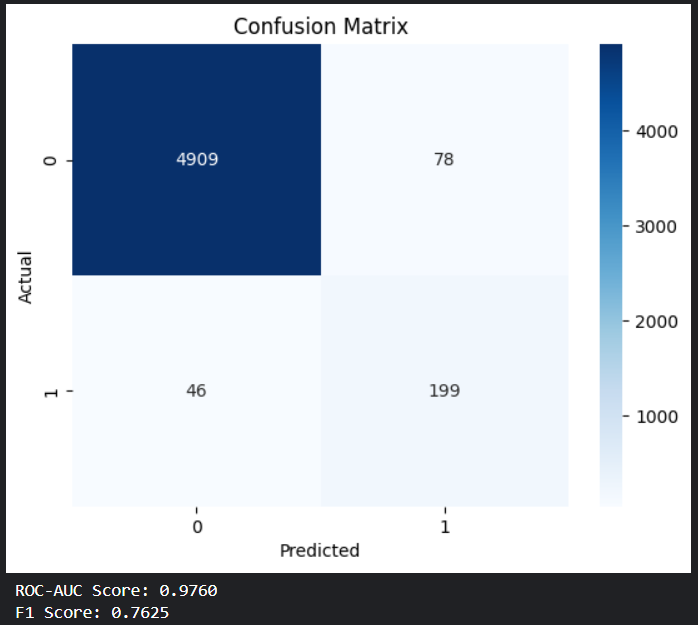

# 🕵️‍♂️ Fake Job Posting Detection using Machine Learning

This project is focused on detecting fraudulent job postings using machine learning and natural language processing (NLP). With the increasing number of online job scams, it's essential to build intelligent systems that can differentiate between real and fake listings.

## 📌 Project Overview

- ✅ Binary classification: Real vs. Fake job postings  
- 📄 Data: Real-world dataset with features like title, company, location, description, and more  
- 🧹 Preprocessing: Cleaned text, handled missing values, and encoded categorical data  
- ✨ Feature Engineering: TF-IDF vectorization on textual features  
- 📊 Analysis: Used Theil’s U and Point-Biserial Correlation to understand feature importance  
- 🤖 Model: Logistic Regression with evaluation metrics such as accuracy, recall, and confusion matrix  
- 📈 Visualization: Word clouds, class distribution, correlation heatmaps, and term frequency plots  

---


---

## 🔍 Key Techniques Used

### 🧠 Machine Learning:
- Logistic Regression for classification
- Evaluation using confusion matrix, precision, recall, and accuracy

### 📚 NLP:
- Tokenization and stopword removal (NLTK)
- TF-IDF Vectorization for textual feature representation

### 📈 Feature Insight Tools:
- **Theil’s U**: To analyze asymmetric relationships between categorical features
- **Point-Biserial Correlation**: To evaluate continuous features against the binary target

---

## 🛠️ Tools & Libraries

- Python 3.11+
- Pandas, NumPy, Matplotlib, Seaborn
- Scikit-learn
- Embedding throigh 'distilbert-base-uncased'
- Classification through custom ANN
- Evaluation : classification_report, f1-score, confusion matrix
---
## Preview of the result


---
## 🚀 How to Run

1. Clone the repository
```bash
git clone https://github.com/yourusername/fake-job-detection.git
cd fake-job-detection

